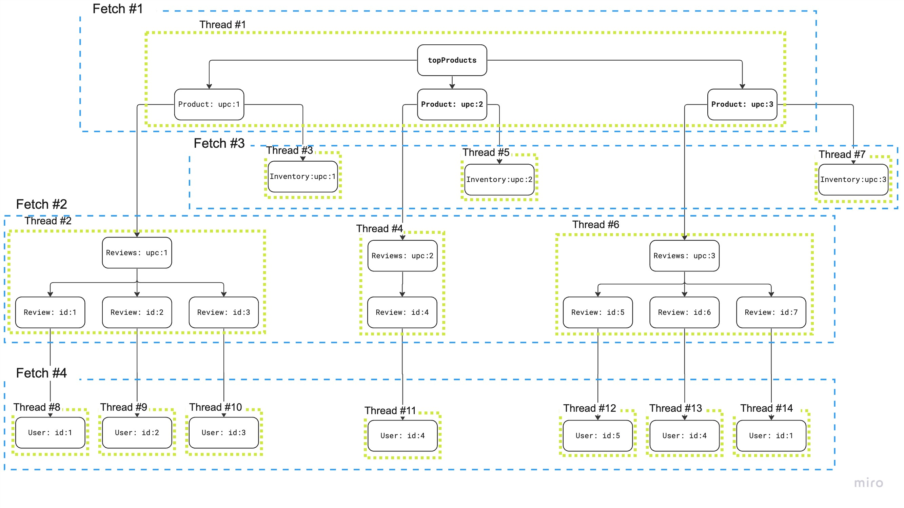
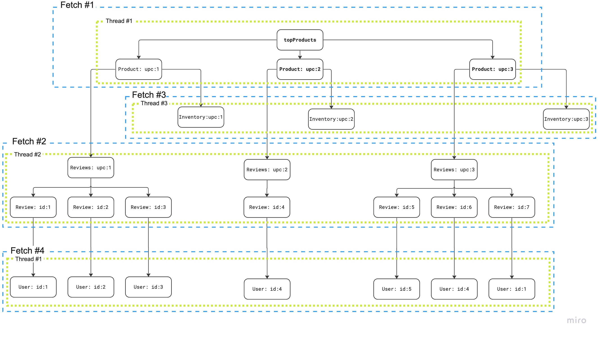

# Dataloader 3.0: Новый алгоритм для решения проблемы N+1

При реализации Cosmo Router, open-source замена Apollo Router, мы столкнулись с проблемой поддержания нашего кода для решения проблемы N+1. Реализация маршрутизатора для федеративных служб GraphQL в значительной степени зависит от возможности группировать вложенные запросы GraphQL для сокращения числа запросов к подграфам.

Чтобы решить эту проблему, мы разработали новый алгоритм, который решает проблему N+1 более эффективно и проще для поддержания, чем наше предыдущее решение, которое было основано на шаблоне DataLoader, обычно используемом в сообществе GraphQL. Вместо разрешения сначала по глубине, мы загружаем данные сначала по ширине, что позволяет нам сократить параллелизм с O(N^2) до O(1) и улучшить производительность до 5 раз, сокращая сложность кода.

Если вы заинтересованы в проверке кода, вы можете найти его на [GitHub](https://github.com/wundergraph/cosmo).

Я также провел лекцию на эту тему на GraphQL Conf 2023, которую вы можете посмотреть здесь: https://youtu.be/vWQYI5fNytM

## Проблема N+1

Проблема N+1 - это общая проблема в GraphQL, которая возникает, когда у вас есть список элементов, и вам нужно получить дополнительные данные для каждого элемента в списке. Давайте рассмотрим пример, чтобы проиллюстрировать эту проблему:

Сначала мы определяем четыре подграфа:

```graphql
# Products
type Query {
  topProducts: [Product!]
}

type Product @key(fields: "upc") {
  upc: String!
  name: String!
}

# Inventory
type Product @key(fields: "upc") {
  upc: String! @external
  stock: Int!
}

# Accounts
type User @key(fields: "id") {
   id: ID!
   name: String
}

# Reviews
type Review @key(fields: "id") {
   id: ID!
   body: String
   author: User
}

type User @key(fields: "id") {
   id: ID! @external
}

type Product @key(fields: "upc") {
   upc: String! @external
   reviews: [Review]
}
```

Затем мы определяем запрос, который получает топ продуктов и их обзоры:

```graphql
query {
 topProducts { # returns a list of products from the Products subgraph
    name
    stock # returns the stock from the Inventory subgraph
    reviews { # returns a list of reviews from the Reviews subgraph
      body
      author { # returns the author from the Accounts subgraph
        name
      }
    }
  }
}
```

Откуда взялось название проблемы N+1? `+1` относится к первому запросу на получение `topProducts` из подграфа Products. `N` относится к числу дополнительных запросов, которые требуются для получения связанных данных для каждого продукта. Давайте пройдемся по шагам разрешения этого запроса, чтобы увидеть, что это означает на практике.

Допустим, поле `topProducts` возвращает 3 продукта. Мы должны сделать 3 дополнительных запроса, чтобы получить запасы для каждого продукта из подграфа Inventory. Мы также должны сделать 3 дополнительных запроса, чтобы получить обзоры для каждого продукта из подграфа Reviews. Мы просто предполагаем, что у каждого продукта есть 3 обзора. Для каждого обзора мы должны сделать 1 дополнительный запрос, чтобы получить автора из подграфа Accounts. Таким образом, в общей сложности мы должны сделать 1 + 3 + 3 + 3 * 3 = 16 запросов, чтобы разрешить этот запрос.

Если вы внимательно посмотрите, вы увидите, что количество запросов растет экспоненциально с глубиной запроса и количеством элементов в списке, где вложенные списки усугубляют проблему, как в нашем примере, где у каждого продукта есть список обзоров. Что, если у каждого обзора был список комментариев, а у каждого комментария - список лайков? Вы видите, куда это ведет.

## Шаблон DataLoader

Шаблон DataLoader - это общее решение для решения проблемы N+1 в GraphQL. Он основан на идее группировки запросов в списках для сокращения числа запросов. Что замечательно в GraphQL, так это то, что он позволяет нам группировать запросы по умолчанию. С REST API, вам нужно явно реализовать конечные точки группировки, но с GraphQL, вы можете легко объединить несколько запросов в один запрос.

Кроме того, Федерация делает группировку еще проще, потому что хорошо известное поле `_entities` для извлечения "Сущностей" поддерживает список представлений в качестве входных данных. Это означает, что извлечение сущностей по их ключам позволяет вам группировать запросы по умолчанию. Все, что нам нужно сделать, это убедиться, что мы действительно группируем запросы в списках вместе, чтобы использовать эту функцию, что и делает шаблон DataLoader. Используя шаблон DataLoader, мы можем сократить количество запросов с 16 до 4, один запрос для загрузки `topProducts`, один для загрузки информации о запасах, один для загрузки обзоров и один для загрузки авторов.

Давайте посмотрим на пример, чтобы проиллюстрировать, как работает шаблон DataLoader:

Если мы добавим необходимые ключевые поля, то есть поля, которые используются для извлечения сущностей по их ключам, наш GraphQL запрос выше выглядит так:

```graphql
query {
 topProducts {
    __typename
    upc
    name
    stock
    reviews {
      __typename
      id
      body
      author {
        __typename
        id
        name
      }
    }
  }
}
```

Первый шаг - это получить `topProducts` из подграфа Products. Вот как выглядит запрос:

```graphql
query {
 topProducts {
    __typename
    upc
    name
  }
}
```

Допустим, подграф Products возвращает 3 продукта, вот как может выглядеть наш ответ:

```json
{
  "data": {
    "topProducts": [
      {
        "__typename": "Product",
        "upc": "1",
        "name": "Table"
      },
      {
        "__typename": "Product",
        "upc": "2",
        "name": "Couch"
      },
      {
        "__typename": "Product",
        "upc": "3",
        "name": "Chair"
      }
    ]
  }
}
```

Теперь мы пройдемся по всем продуктам и загрузим связанные данные для каждого продукта. Давайте сделаем это для первого продукта.

Вот как выглядит наш "ввод":

```json
{
  "__typename": "Product",
  "upc": "1",
  "name": "Table"
}
```

Теперь нам нужно получить запасы для этого продукта из подграфа Inventory.

```graphql
query {
  _entities(representations: [
    {
      __typename: "Product",
      upc: "1"
    }
  ]) {
    __typename
    ... on Product {
      stock
    }
  }
}
```

Хотя этот запрос работает, он не позволяет нам сгруппировать два других продукта-друга. Давайте изменим запрос, чтобы разрешить группировку, используя переменные вместо встраивания представлений непосредственно в запрос:

```graphql
query($representations: [_Any!]!) {
  _entities(representations: $representations) {
    __typename
    ... on Product {
      stock
    }
  }
}
```

Этот запрос будет точно таким же для всех продуктов. Единственное отличие будет в значении переменной `$representations`. Это позволяет нам реализовать упрощенную версию шаблона DataLoader.

Вот как это может выглядеть: Это функция, которая принимает запрос и список представлений в качестве входных данных. Затем функция будет хешировать запрос и объединять все представления для одного и того же запроса в один запрос. Если есть дублирующиеся представления, мы удалим дубликаты перед созданием объекта переменных. Она будет делать запрос для каждого уникального запроса и возвращать "негруппированные" результаты каждому вызывающему.

```js
async function load(query: string, representations: any[]) {
  const hash = hashQuery(query);
  return loadUnique(hash, query, representations);
}
async function loadUnique(hash: string, query: string, representations: any[]) {
  const variables = {
    representations: uniqueRepresentations(representations),
  };
  const result = await fetch(query, {
    method: "POST",
    body: JSON.stringify({ query, variables }),
  });
  const data = await result.json();
  return unbatchEntities(data);
}
```

Отлично! Мы реализовали упрощенную версию шаблона DataLoader и использовали его для загрузки данных о запасах каждого товара. Теперь давайте также загрузим отзывы.

```graphql
query($representations: [_Any!]!) {
  _entities(representations: $representations) {
    __typename
    ... on Product {
      reviews {
        __typename
        id
        body
        author {
          __typename
          id
        }
      }
    }
  }
}
```

Прогоните это через нашу функцию `load`, и мы получим отзывы для каждого товара. Предположим, что у каждого товара есть 3 отзыва. Вот как может выглядеть ответ:

```json
{
  "data": {
    "_entities": [
      {
        "reviews": [
          {
            "__typename": "Review",
            "id": "1",
            "body": "Love it!",
            "author": {
              "__typename": "User",
              "id": "1"
            }
          },
          {
            "__typename": "Review",
            "id": "2",
            "body": "Hate it!",
            "author": {
              "__typename": "User",
              "id": "2"
            }
          },
          {
            "__typename": "Review",
            "id": "3",
            "body": "Meh!",
            "author": {
              "__typename": "User",
              "id": "3"
            }
          }
        ]
      }
    ]
  }
}
```

Далее мы заходим в каждый обзор и загружаем автора из подграфа Accounts.

Вот как выглядит наш ввод для первой рецензии:

```json
{
  "__typename": "Review",
  "id": "1",
  "body": "Love it!",
  "author": {
    "__typename": "User",
    "id": "1"
  }
}
```

Теперь нам нужно найти автора этой рецензии из подграфа Accounts.

```graphql
query {
  _entities(representations: [
    {
      __typename: "User",
      id: "1"
    }
  ]) {
    __typename
    ... on User {
      name
    }
  }
}
```

И снова мы делаем это для всех друзей и объединяем запросы для одного и того же запроса. Наконец, мы закончили загрузку всех данных и можем вывести JSON-ответ в соответствии со спецификацией GraphQL и вернуть его клиенту.

## Проблема с шаблоном DataLoader

На первый взгляд, шаблон DataLoader кажется отличным ответом для решения проблемы N+1. В конце концов, он значительно сокращает количество запросов с 16 до 4, так в чем может быть проблема?

Есть две основные проблемы с шаблоном DataLoader.

Во-первых, он делает компромисс между производительностью и сложностью кода. Хотя мы сокращаем количество запросов, мы значительно увеличиваем сложность нашего кода. Хотя это не видно в однопоточной среде, такой как Node.js, многопоточные среды, такие как Go или Rust, будут испытывать трудности с эффективным использованием этого шаблона. Я вернусь к этому позже.

Во-вторых, хотя шаблон DataLoader сокращает количество запросов, он экспоненциально увеличивает параллелизм нашего кода. С каждым уровнем вложенности и каждым элементом в списке мы экспоненциально увеличиваем количество одновременных запросов, которые выполняются в "DataLoader".

Это сводится к фундаментальному недостатку в шаблоне DataLoader. Для того чтобы иметь возможность группировать запросы нескольких полей-друзей, все поля-друзья должны "присоединиться" к пакету одновременно. Это означает, что мы должны одновременно пройти через все поля-друзья и заставить их вызвать функцию `load` DataLoader в одно и то же время. Как только все поля-друзья присоединились к этому пакету, они блокируются, пока пакет не будет разрешен.

Но это становится еще хуже с вложенными списками. Для нашего корневого списка мы должны разветвиться в 3 параллельные операции, чтобы загрузить данные для всех 3 продуктов, используя шаблон DataLoader. Так что у нас есть параллелизм на 4, если мы также учитываем корневое поле. Но поскольку мы загружаем не только информацию о запасах, но и обзоры для каждого продукта, мы должны добавить еще 3 параллельные операции для каждого продукта. С этим мы находимся на уровне параллелизма 7. Но мы еще не закончили. Как мы обсуждали, мы предполагаем, что получим обратно 3 обзора для каждого продукта. Чтобы загрузить автора для каждого обзора, нам, следовательно, нужно разветвиться в 9 параллельных операций для каждого обзора. С этим мы находимся на уровне параллелизма 16.

Чтобы проиллюстрировать эту проблему, вот визуализация из доклада. Цифры немного отличаются, но проблема остается той же.



Как вы можете видеть, группировка зависит от возможности одновременного вызова функции `load` для всех полей-друзей.

Как я упоминал ранее, есть не только дополнительные затраты на параллелизм, но и для неоднопоточных сред, таких как Go, Rust, Java и т.д., необходимость одновременного разрешения полей-друзей представляет собой еще одну проблему.

Федерация, но также и другие композитные стили GraphQL позволяют вам определять зависимости между полями. Это означает, что вы можете определить, что поле `@requires` другое поле, которое должно быть разрешено, прежде чем оно сможет быть разрешено само по себе. Например, у вас может быть объект пользователя, который содержит поле `id`. С помощью поля `id` вы можете получить улицу и номер дома пользователя. Как только у вас есть эти два, вы можете получить полный адрес пользователя, который зависит от других двух полей.

В худшем случае может произойти следующее. У вас есть список объектов пользователей-друзей. Для каждого из них вы загружаете группой улицу и номер дома. Вы делаете это одновременно. Как только это сделано, вы должны объединить результаты с исходными объектами пользователя. Затем вы снова проходите через каждый объект пользователя, одновременно, и загружаете группой полный адрес.

Добавляя параллелизм к этой операции, мы должны синхронизировать результаты, мы должны убедиться, что мы не читаем и не записываем одни и те же объекты одновременно, или мы должны скопировать все объекты, когда мы разветвляемся в параллельные операции, а затем убедиться, что когда мы объединяем результаты, мы не записываем в одни и те же объекты одновременно.

В любом случае нам придется копировать множество объектов, синхронизировать параллельные операции или даже использовать блокировки и мьютексы, чтобы исключить одновременное чтение и запись одних и тех же объектов. Все это может не только усложнить наш код, но и негативно сказаться на производительности.

Если у вас есть опыт работы с сильно параллельным кодом, вы можете знать, что отлаживать параллельный код очень сложно. Если отладчик перескакивает между потоками, трудно проследить за ходом выполнения кода. Именно здесь печать в консоль снова становится полезным инструментом отладки.

Тем не менее, было бы здорово избавиться от всего этого параллелизма. Что, если бы мы могли писать простой синхронный код, свободный от блокировок, мьютексов, потоков и других примитивов параллелизма? И именно это мы и сделали!

## Новый алгоритм для решения проблемы N+1 - загрузка данных в ширину

Большинство, если не все серверы GraphQL, разрешают поля в глубину. Это означает, что они разрешают поле и все его подполя, прежде чем разрешают следующее поле-друга. Таким образом, в списке элементов они исчерпывающе разрешают один элемент за другим. Если мы говорим о деревьях, они разрешают самую левую ветвь, пока не достигнут листового узла, затем они разрешают следующую ветвь и так далее, пока не достигнут самой правой ветви.

Это кажется естественным, потому что так мы бы "печатали" JSON в буфер. Вы открываете первую фигурную скобку, печатаете первое поле, открываете другую фигурную скобку, чтобы начать объект, печатаете содержимое объекта, закрываете фигурную скобку и так далее.

Так как же мы можем избавиться от необходимости разрешать поля-друзья одновременно для включения группировки? Решение состоит в том, чтобы разделить резолвер на две части. Сначала мы проходим через "План запроса" в ширину, загружаем все данные, которые нам нужны из подграфов, и объединяем результаты в один объект JSON. Во-вторых, мы проходим через объединенный объект JSON в глубину и печатаем ответ JSON в буфер в соответствии с запросом GraphQL от клиента.

Поскольку это может быть немного абстрактно, давайте пройдемся по примеру шаг за шагом.

Сначала мы загружаем `topProducts` из подграфа Products, как мы делали это раньше. Ответ все еще выглядит так:

```json
{
  "data": {
    "topProducts": [
      {
        "__typename": "Product",
        "upc": "1",
        "name": "Table"
      },
      {
        "__typename": "Product",
        "upc": "2",
        "name": "Couch"
      },
      {
        "__typename": "Product",
        "upc": "3",
        "name": "Chair"
      }
    ]
  }
}
```

Затем мы проходим "в ширину" в список продуктов. Это дает нам то, что мы называем "элементами", список объектов.

```json
[
  {
    "__typename": "Product",
    "upc": "1",
    "name": "Table"
  },
  {
    "__typename": "Product",
    "upc": "2",
    "name": "Couch"
  },
  {
    "__typename": "Product",
    "upc": "3",
    "name": "Chair"
  }
]
```

У нас теперь есть список продуктов, поэтому мы можем загрузить информацию о запасах для всех продуктов сразу. Давайте вспомним запрос, который нам нужен для загрузки информации о запасах:

```graphql
query($representations: [_Any!]!) {
  _entities(representations: $representations) {
    __typename
    ... on Product {
      stock
    }
  }
}
```

Мы можем просто вызвать эту операцию с нашим списком элементов в качестве входных данных, исключая, конечно, поле `name`. Кроме того, вы можете видеть, что нам больше не нужен шаблон DataLoader. Нам не нужен параллелизм для группировки запросов для полей-друзей. Все, что мы делаем, это вызываем подграф Inventory с списком представлений продуктов в качестве входных данных.

Результат этой операции точно такой же, как и раньше:

```json
{
  "data": {
    "_entities": [
      {
        "stock": 10
      },
      {
        "stock": 5
      },
      {
        "stock": 2
      }
    ]
  }
}
```

Давайте объединим его с элементами, которые мы получили из подграфа Products:

```json
[
  {
    "__typename": "Product",
    "upc": "1",
    "name": "Table",
    "stock": 10
  },
  {
    "__typename": "Product",
    "upc": "2",
    "name": "Couch",
    "stock": 5
  },
  {
    "__typename": "Product",
    "upc": "3",
    "name": "Chair",
    "stock": 2
  }
]
```

Алгоритм объединения довольно прост. На основе позиции продукта в списке мы объединяем информацию о запасах из ответа `_entities` в объект продукта.

Мы повторяем этот процесс для обзоров. Давайте предположим, что у нас есть 3 обзора для каждого продукта. Это вернет массив сущностей с 3 обзорами каждый.

```json
[
  {
    "reviews": [
      {
        "__typename": "Review",
        "id": "1",
        "body": "Love it!",
        "author": {
          "__typename": "User",
          "id": "1"
        }
      },
      {
        "__typename": "Review",
        "id": "2",
        "body": "Hate it!",
        "author": {
          "__typename": "User",
          "id": "2"
        }
      },
      {
        "__typename": "Review",
        "id": "3",
        "body": "Meh!",
        "author": {
          "__typename": "User",
          "id": "3"
        }
      }
    ]
  },
  {
    "reviews": [
      {
        "__typename": "Review",
        "id": "4",
        "body": "Love it!",
        "author": {
          "__typename": "User",
          "id": "4"
        }
      },
      {
        "__typename": "Review",
        "id": "5",
        "body": "Hate it!",
        "author": {
          "__typename": "User",
          "id": "5"
        }
      },
      {
        "__typename": "Review",
        "id": "6",
        "body": "Meh!",
        "author": {
          "__typename": "User",
          "id": "6"
        }
      }
    ]
  },
  {
    "reviews": [
      {
        "__typename": "Review",
        "id": "7",
        "body": "Love it!",
        "author": {
          "__typename": "User",
          "id": "7"
        }
      },
      {
        "__typename": "Review",
        "id": "8",
        "body": "Hate it!",
        "author": {
          "__typename": "User",
          "id": "8"
        }
      },
      {
        "__typename": "Review",
        "id": "9",
        "body": "Meh!",
        "author": {
          "__typename": "User",
          "id": "9"
        }
      }
    ]
  }
]
```

Давайте сделаем то же самое, что мы делали раньше, и объединим обзоры в каждый из элементов продукта.

```json
[
  {
    "__typename": "Product",
    "upc": "1",
    "name": "Table",
    "stock": 10,
    "reviews": [
      {
        "__typename": "Review",
        "id": "1",
        "body": "Love it!",
        "author": {
          "__typename": "User",
          "id": "1"
        }
      },
      {
        "__typename": "Review",
        "id": "2",
        "body": "Hate it!",
        "author": {
          "__typename": "User",
          "id": "2"
        }
      },
      {
        "__typename": "Review",
        "id": "3",
        "body": "Meh!",
        "author": {
          "__typename": "User",
          "id": "3"
        }
      }
    ]
  },
  {
    "__typename": "Product",
    "upc": "2",
    "name": "Couch",
    "stock": 5,
    "reviews": [
      {
        "__typename": "Review",
        "id": "4",
        "body": "Love it!",
        "author": {
          "__typename": "User",
          "id": "4"
        }
      },
      {
        "__typename": "Review",
        "id": "5",
        "body": "Hate it!",
        "author": {
          "__typename": "User",
          "id": "5"
        }
      },
      {
        "__typename": "Review",
        "id": "6",
        "body": "Meh!",
        "author": {
          "__typename": "User",
          "id": "6"
        }
      }
    ]
  },
  {
    "__typename": "Product",
    "upc": "3",
    "name": "Chair",
    "stock": 2,
    "reviews": [
      {
        "__typename": "Review",
        "id": "7",
        "body": "Love it!",
        "author": {
          "__typename": "User",
          "id": "7"
        }
      },
      {
        "__typename": "Review",
        "id": "8",
        "body": "Hate it!",
        "author": {
          "__typename": "User",
          "id": "8"
        }
      },
      {
        "__typename": "Review",
        "id": "9",
        "body": "Meh!",
        "author": {
          "__typename": "User",
          "id": "9"
        }
      }
    ]
  }
]
```

Отлично! Мы получили продукты, информацию о запасах и обзоры для каждого продукта. Как теперь мы разрешим поле `author` для каждого обзора?

Первый шаг - это пройти "в ширину" в список обзоров. Наши "элементы" тогда будут выглядеть так:

```json
[
  {
    "__typename": "Review",
    "id": "1",
    "body": "Love it!",
    "author": {
      "__typename": "User",
      "id": "1"
    }
  },
  {
    "__typename": "Review",
    "id": "2",
    "body": "Hate it!",
    "author": {
      "__typename": "User",
      "id": "2"
    }
  },
  {
    "__typename": "Review",
    "id": "3",
    "body": "Meh!",
    "author": {
      "__typename": "User",
      "id": "3"
    }
  },
  {
    "__typename": "Review",
    "id": "4",
    "body": "Love it!",
    "author": {
      "__typename": "User",
      "id": "4"
    }
  },
  {
    "__typename": "Review",
    "id": "5",
    "body": "Hate it!",
    "author": {
      "__typename": "User",
      "id": "5"
    }
  },
  {
    "__typename": "Review",
    "id": "6",
    "body": "Meh!",
    "author": {
      "__typename": "User",
      "id": "6"
    }
  },
  {
    "__typename": "Review",
    "id": "7",
    "body": "Love it!",
    "author": {
      "__typename": "User",
      "id": "7"
    }
  },
  {
    "__typename": "Review",
    "id": "8",
    "body": "Hate it!",
    "author": {
      "__typename": "User",
      "id": "8"
    }
  },
  {
    "__typename": "Review",
    "id": "9",
    "body": "Meh!",
    "author": {
      "__typename": "User",
      "id": "9"
    }
  }
]
```

Это просто список обзоров, отлично. Затем мы переходим к `authors`, снова используя обход в ширину, что приводит нас к списку пользователей.

```json
[
  {
    "__typename": "User",
    "id": "1"
  },
  {
    "__typename": "User",
    "id": "2"
  },
  {
    "__typename": "User",
    "id": "3"
  },
  {
    "__typename": "User",
    "id": "4"
  },
  {
    "__typename": "User",
    "id": "5"
  },
  {
    "__typename": "User",
    "id": "6"
  },
  {
    "__typename": "User",
    "id": "7"
  },
  {
    "__typename": "User",
    "id": "8"
  },
  {
    "__typename": "User",
    "id": "9"
  }
]
```

Теперь мы можем загрузить поле `name` для всех пользователей сразу, без параллелизма, просто одним запросом к подграфу Accounts.

```graphql
query($representations: [_Any!]!) {
  _entities(representations: $representations) {
    __typename
    ... on User {
      name
    }
  }
}
```

Результат может выглядеть так:

```json
{
  "data": {
    "_entities": [
      {
        "name": "Alice"
      },
      {
        "name": "Bob"
      },
      {
        "name": "Carol"
      },
      {
        "name": "Dave"
      },
      {
        "name": "Eve"
      },
      {
        "name": "Frank"
      },
      {
        "name": "Grace"
      },
      {
        "name": "Heidi"
      },
      {
        "name": "Ivan"
      }
    ]
  }
}
```

Давайте объединим его со списком пользователей:

```json
[
  {
    "__typename": "User",
    "id": "1",
    "name": "Alice"
  },
  {
    "__typename": "User",
    "id": "2",
    "name": "Bob"
  },
  {
    "__typename": "User",
    "id": "3",
    "name": "Carol"
  },
  {
    "__typename": "User",
    "id": "4",
    "name": "Dave"
  },
  {
    "__typename": "User",
    "id": "5",
    "name": "Eve"
  },
  {
    "__typename": "User",
    "id": "6",
    "name": "Frank"
  },
  {
    "__typename": "User",
    "id": "7",
    "name": "Grace"
  },
  {
    "__typename": "User",
    "id": "8",
    "name": "Heidi"
  },
  {
    "__typename": "User",
    "id": "9",
    "name": "Ivan"
  }
]
```

Теперь все, что нам нужно сделать, это "подняться" по дереву и объединить разрешенные элементы в их родительские объекты. Здесь есть одна важная вещь, которую нужно отметить. Когда мы переходим в список элементов внутри элемента, нам нужно отметить, какие индексы дочерних элементов принадлежат какому родительскому элементу. Возможно, что у нас есть списки неравной длины внутри списка элементов, поэтому мы бы нарушили порядок, если бы не отслеживали индексы дочерних элементов.

Так что если мы поднимаемся по дереву и объединяем пользователей в обзоры, наши элементы будут выглядеть так:

```json
[
  {
    "__typename": "Review",
    "id": "1",
    "body": "Love it!",
    "author": {
      "__typename": "User",
      "id": "1",
      "name": "Alice"
    }
  },
  {
    "__typename": "Review",
    "id": "2",
    "body": "Hate it!",
    "author": {
      "__typename": "User",
      "id": "2",
      "name": "Bob"
    }
  },
  {
    "__typename": "Review",
    "id": "3",
    "body": "Meh!",
    "author": {
      "__typename": "User",
      "id": "3",
      "name": "Carol"
    }
  },
  {
    "__typename": "Review",
    "id": "4",
    "body": "Love it!",
    "author": {
      "__typename": "User",
      "id": "4",
      "name": "Dave"
    }
  },
  {
    "__typename": "Review",
    "id": "5",
    "body": "Hate it!",
    "author": {
      "__typename": "User",
      "id": "5",
      "name": "Eve"
    }
  },
  {
    "__typename": "Review",
    "id": "6",
    "body": "Meh!",
    "author": {
      "__typename": "User",
      "id": "6",
      "name": "Frank"
    }
  },
  {
    "__typename": "Review",
    "id": "7",
    "body": "Love it!",
    "author": {
      "__typename": "User",
      "id": "7",
      "name": "Grace"
    }
  },
  {
    "__typename": "Review",
    "id": "8",
    "body": "Hate it!",
    "author": {
      "__typename": "User",
      "id": "8",
      "name": "Heidi"
    }
  },
  {
    "__typename": "Review",
    "id": "9",
    "body": "Meh!",
    "author": {
      "__typename": "User",
      "id": "9",
      "name": "Ivan"
    }
  }
]
```

Всего девять обзоров с информацией об авторе в каждом обзоре. Наконец, мы проходим по дереву в последний раз и объединяем отзывы с товарами. Наш результирующий объект будет выглядеть следующим образом:

```json
[
  {
    "__typename": "Product",
    "upc": "1",
    "name": "Table",
    "stock": 10,
    "reviews": [
      {
        "__typename": "Review",
        "id": "1",
        "body": "Love it!",
        "author": {
          "__typename": "User",
          "id": "1",
          "name": "Alice"
        }
      },
      {
        "__typename": "Review",
        "id": "2",
        "body": "Hate it!",
        "author": {
          "__typename": "User",
          "id": "2",
          "name": "Bob"
        }
      },
      {
        "__typename": "Review",
        "id": "3",
        "body": "Meh!",
        "author": {
          "__typename": "User",
          "id": "3",
          "name": "Carol"
        }
      }
    ]
  },
  {
    "__typename": "Product",
    "upc": "2",
    "name": "Couch",
    "stock": 5,
    "reviews": [
      {
        "__typename": "Review",
        "id": "4",
        "body": "Love it!",
        "author": {
          "__typename": "User",
          "id": "4",
          "name": "Dave"
        }
      },
      {
        "__typename": "Review",
        "id": "5",
        "body": "Hate it!",
        "author": {
          "__typename": "User",
          "id": "5",
          "name": "Eve"
        }
      },
      {
        "__typename": "Review",
        "id": "6",
        "body": "Meh!",
        "author": {
          "__typename": "User",
          "id": "6",
          "name": "Frank"
        }
      }
    ]
  },
  {
    "__typename": "Product",
    "upc": "3",
    "name": "Chair",
    "stock": 2,
    "reviews": [
      {
        "__typename": "Review",
        "id": "7",
        "body": "Love it!",
        "author": {
          "__typename": "User",
          "id": "7",
          "name": "Grace"
        }
      },
      {
        "__typename": "Review",
        "id": "8",
        "body": "Hate it!",
        "author": {
          "__typename": "User",
          "id": "8",
          "name": "Heidi"
        }
      },
      {
        "__typename": "Review",
        "id": "9",
        "body": "Meh!",
        "author": {
          "__typename": "User",
          "id": "9",
          "name": "Ivan"
        }
      }
    ]
  }
]
```

И это все! Теперь мы загрузили все данные, которые нам нужны для формирования окончательного ответа JSON. Поскольку мы могли загрузить ненужные данные, например, обязательные поля, и мы не учитываем псевдонимы, это необходимый шаг, чтобы гарантировать, что наш ответ JSON имеет точно такую форму, которую запросил клиент.

Это был взгляд на алгоритм с очень низкой высоты. Давайте немного отдалимся и посмотрим на этот алгоритм с более высокого уровня.



Вы заметите две вещи на этой визуализации. Он показывает 3 потока вместо одного. Это потому, что мы параллелизируем получение информации о запасах и обзоры. Это возможно, потому что они находятся на одном уровне в дереве и зависят только от продуктов. Второе, что вы заметите, это то, что кроме параллелизации двух вышеупомянутых операций, мы вообще не используем параллелизм.

Ключевое отличие разрешения полей в ширину, а не в глубину, заключается в том, что мы всегда можем автоматически группировать запросы для полей-друзей, так как у нас всегда есть список элементов (друзей), вместо того чтобы посещать каждый элемент (друга) ветка за веткой (в глубину) параллельно.

Говоря о параллелизме и параллелизации, мы сделали еще одно важное наблюдение относительно параллельных выборок на одном уровне в дереве, как мы делали это для информации о запасах и обзорах.

Во время нашего исследования мы изначально попытались параллелизовать два пакета и немедленно объединить результаты в элементы. Это оказалось плохой идеей, так как это потребовало бы от нас синхронизации объединения, например, с использованием мьютекса. Это сделало код более сложным и негативно повлияло на производительность.

Вместо этого мы нашли лучшее решение. Когда мы рендерим входные данные для каждого из пакетов, мы только читаем из элементов, поэтому это безопасно делать параллельно. Вместо того чтобы немедленно объединять результаты в элементы, мы предварительно выделяем один набор результатов для каждого пакета, чтобы временно хранить результаты для каждого пакета. Затем мы ждем, пока все параллелизованные пакеты не завершатся, и объединяем результаты из наборов результатов в элементы в основном потоке. Таким образом, нам вообще не нужно синхронизироваться и мы можем полностью обойтись без блокировок, хотя мы используем параллелизм для получения пакетов.

## Преимущества загрузки данных в ширину

Теперь, когда мы подробно рассмотрели алгоритм, давайте поговорим о преимуществах загрузки данных в ширину.

- Мы избавились от нашей реализации DataLoader
- У нас нет параллелизма, за исключением параллельных выборок на одном уровне в дереве
- Нам не нужно синхронизировать параллельные операции
- Нам не нужно использовать блокировки или мьютексы

Мы снова можем легко отлаживать наш код, и вся реализация намного проще для понимания и поддержки. На самом деле, наша первоначальная реализация не была полностью завершена, но мы смогли быстро исправить и расширить ее, так как код был легким для понимания.

Как побочный эффект, хотя это не было нашей основной целью, мы видели улучшения производительности до 5 раз по сравнению с нашей предыдущей реализацией, использующей шаблон DataLoader. На самом деле, разрыв в производительности увеличивается с увеличением количества элементов в списках и уровня вложенности, что отлично иллюстрирует проблему с шаблоном DataLoader.

## Заключение

Шаблон DataLoader - отличное решение для решения проблемы N+1. Это отличное решение для улучшения проблемы N+1, но, как мы видели, у него есть свои ограничения и он может стать узким местом.

Поскольку мы строим маршрутизатор для федеративного GraphQL, крайне важно сохранять наш код поддерживаемым и с низким накладным расходом на производительность. Возможность сокращения параллелизма нашего кода - огромное преимущество, особенно когда мы можем сократить параллелизм с O(N^2) до O(1).

Так ли это действительно затрагивает только маршрутизаторы федеративного GraphQL, или шлюзы GraphQL, или даже серверы GraphQL в целом?

Я думаю, что мы все должны быть осведомлены о компромиссах, которые мы делаем, используя шаблон DataLoader. Существуют фреймворки, такие как Grafast, которые предлагают совершенно новые подходы к разрешению операций GraphQL. Это хорошее время, чтобы поставить под сомнение статус-кво и посмотреть, можем ли мы применить эти знания и применить их к нашему собственному серверу и фреймворкам GraphQL.

Следует ли фреймворкам GraphQL рассмотреть возможность реализации загрузки данных в ширину? Стоит ли вам рассмотреть возможность реализации пакетной загрузки как гражданина первого класса на вашем сервере GraphQL? Я не знаю ответа, но я думаю, что правильно задать эти вопросы. Мне было бы интересно услышать ваши мысли по этому поводу.

Еще раз, реализация является открытой и [доступна на GitHub](https://github.com/wundergraph/cosmo).